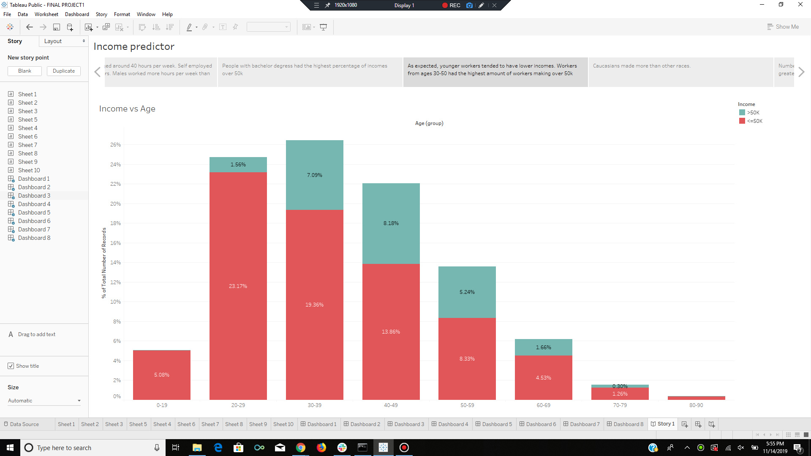
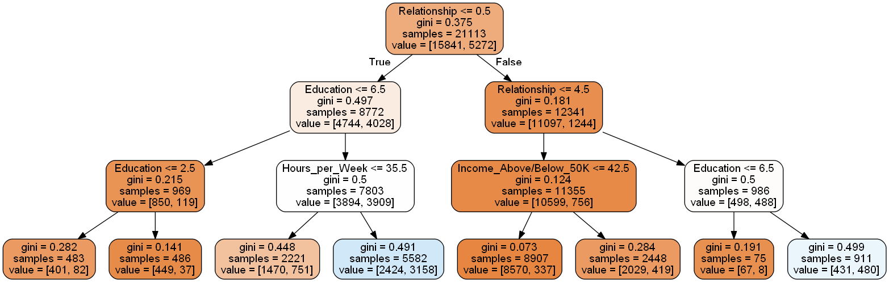
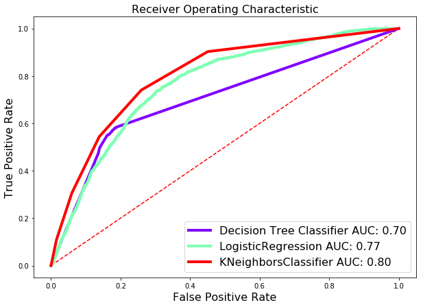

## Analysis and Prediction of US Income Using Machine Learning  
                                  

### Project Description:

This machine learning project uses United States census data to predict whether a person will earn greater than or less than $50,000 per year. The data set includes 41 different demographic attributes, which our models incorporate in order to predict the income bracket of a given individual. Tableau is also used to create visualizations for data exploration.

## Table of contents
* [Screenshots](#screenshots)
* [Technologies](#technologies)
* [Authors](#authors)
* [Sources](#sources)
* [Conclusion](#conclusion)

## Screenshots 

 

	
## Technologies
Project is created with:
* Python
* Pandas
* SciKitLearn
* MatPlotLib
* Tableau 10.0

## Authors
* Naveen Mudaliar
* Sindhuja Kumar
* Nisa Bukhari
* Syed Rashid
* Jin Joo
* Ebony Postrell

## Sources
UCI Machine Learning Repository, Lichman, M. (2013). Irvine, CA: University of California,
School of Information and Computer Science accessed November 6th, 2016 from

https://archive.ics.uci.edu/ml/datasets/Census+Income
United States Census Bureau, (accessed January 25, 2017), available from

http://www.census.gov/topics/income-poverty/income/about.html 

## Conclusion
This machine learning model was able to predict annual incomes of persons in US based on
20 parameters with an accuracy of 82. This model can be applied to data from other census
years as well. The model will perform better if the training set is updated with new data that
is confirmed for correctness, that is, the label value is the real-life value, and not the predicted value. The model can continuously learn from changing data in the training set to adapt to new parameters, thus improving its accuracy and other metrics.
